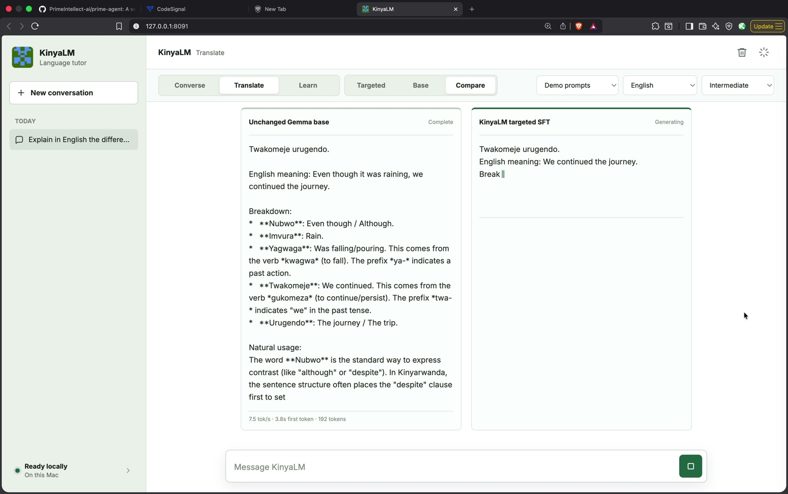
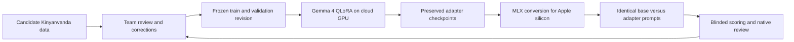

# KinyaLM

KinyaLM is a bilingual Kinyarwanda-English tutor and an open research project
on adapting language models for a lower-resource language. It can converse,
translate, correct learner writing, and explain vocabulary or grammar in a
local streaming chat interface.

The repository keeps two connected tracks:

- **Track A - KILM:** learn the mechanics of tokenization, pretraining,
  checkpointing, and next-token evaluation with a small model built from
  scratch.
- **Track B - KinyaLM:** adapt a stronger multilingual model with reviewed
  tutoring data, QLoRA, blinded evaluation, and local MLX inference.

[](docs/assets/demo/kinyalm-local-demo.mp4)

**[Watch the 4:54 local demo](docs/assets/demo/kinyalm-local-demo.mp4)** |
**[View the presentation](https://docs.google.com/presentation/d/17VHFH5NHdb6pKn_OuXZrz6wXQfmwqdrSuaEoFmZCyOU/edit?usp=sharing)** |
**[Open the shared data lake](https://huggingface.co/datasets/kinyalm/kinyalm-data-lake)**

## Current Result

The strongest KinyaLM adapter is the targeted continuation trained for 780
updates after the source 780-step adapter, or **1,560 cumulative training
steps**. The second stage used a fresh optimizer and a 3,858-row targeted
curriculum; it was not one uninterrupted 1,560-step schedule.

On the same 150-prompt blinded development screen:

| Candidate | Passes | Pass rate | Repetition |
| --- | ---: | ---: | ---: |
| Unchanged Gemma 4 12B | **33/150** | **22.00%** | **4.67%** |
| Targeted continuation | 28/150 | 18.67% | 18.67% |
| Control continuation | 24/150 | 16.00% | 20.67% |
| Source step-780 adapter | 24/150 | 16.00% | 20.67% |

The targeted adapter is the best adapter, but it does **not** yet beat the base
overall. It improved the intended categories over the base: morphology and
grammar by 10 percentage points, sentence correction by 15 points, and
Kinyarwanda-to-English translation by 20 points. It also regressed on
conversation, uncertainty handling, context retention, and repetition.

These are model-assisted development results, not final product claims. A new
hidden benchmark and native-speaker review are required before promotion. See
the [complete continuation report](docs/model/experiments/2026-08-11-continuation-screening.md)
for the paired comparison, limitations, and pinned artifact revisions.

## Run The Local Demo

The full comparison requires an Apple-silicon Mac. The measured base runtime
peaked near 11.4 GB of unified memory, so at least 16 GB is recommended.

```bash
hf auth login
bash scripts/local/chat_gemma4_targeted_web.sh --port 8091 --open
```

The browser opens at `http://127.0.0.1:8091`. The interface provides:

- `Targeted`, `Base`, and side-by-side `Compare` modes;
- conversation, translation, and learning modes;
- English or Kinyarwanda response control and learner levels;
- streaming generation, timing, memory, and reviewer feedback;
- one resident MLX model, with the LoRA contribution disabled for the base arm.

Run only the unchanged base with:

```bash
bash scripts/local/chat_gemma4_web.sh --port 8090 --open
```

The first launch downloads pinned model artifacts. Exact runtime details and
troubleshooting are in the [local demo runbook](docs/model/local-kinyalm-chat-demo.md).

## How The Project Works



The repository treats training loss as an optimization signal, not a language
quality score. Checkpoints are preserved and compared on identical prompts,
system instructions, decoding settings, and runtime conditions. Reviewer
corrections then become the next targeted data batch.

## Project Evidence

| Area | What is available |
| --- | --- |
| Data | Review schemas, immutable generation batches, deduplication, manifests, and a gated team data lake |
| Training | Reproducible Gemma 4 QLoRA profiles, checkpoint preservation, cloud launch scripts, and publication manifests |
| Evaluation | 150-prompt recovery bank, blinded review packs, repetition checks, base-versus-adapter parity, and experiment reports |
| Serving | Local MLX inference, streaming browser chat, feedback capture, and side-by-side comparison |
| Research | Track A learning runs, Track B adaptation experiments, paper matrix, cost records, and failure analyses |

Start with the [experiment ledger](docs/project/appendix-experiment-ledger.md),
[paper decision matrix](docs/project/appendix-paper-matrix.md), and
[project constraints](docs/project/constraints-and-risks.md). The separate
[KILM repository](https://github.com/Jonathan-321/kilm) contains the Track A
from-scratch experiments.

## Multimodal Direction

The next version should remain modular before attempting one end-to-end
multimodal model:

1. Add Kinyarwanda speech recognition and spoken responses.
2. Add a pronunciation coach with word-level feedback.
3. Add image and document lessons through OCR, captioning, and visual Q&A.
4. Evaluate every component separately before measuring end-to-end tutoring.

The [multimodal expansion roadmap](docs/project/multimodal-expansion-roadmap.md)
defines candidate open models and datasets, licenses, architecture, metrics,
and staged release gates.

## Repository Map

```text
apps/kinyalm-chat/       local streaming chat interface
configs/                 frozen data, training, and evaluation profiles
data/                    small shareable samples and artifact manifests
docs/data/               sourcing, review, schema, and data-lake guidance
docs/evaluation/         benchmark plans, task banks, and review rules
docs/model/              training, inference, and experiment reports
docs/project/            charter, evidence, papers, risks, and roadmaps
docs/team/               ownership and contribution workflows
prompts/                 versioned generation and tutoring instructions
scripts/                 data, training, evaluation, cloud, and local tools
src/kinyalm/             reusable project package
tests/                   reproducibility and regression checks
```

Large datasets and model weights belong in the Hugging Face organization, not
Git history. Only small, licensed, reviewable evidence should be committed.

## Development

```bash
uv sync --extra dev
uv run pytest -q
python3 scripts/check_project.py
```

Training dependencies are isolated behind `uv sync --extra train`; Gemini data
generation dependencies use `uv sync --extra distill`.

## Team

- Jonathan Muhire ([@Jonathan-321](https://github.com/Jonathan-321))
- Tessy Mugisha ([@TessyMugisha](https://github.com/TessyMugisha))
- Bonheur Byiringiro ([@BonheurByiringiro](https://github.com/BonheurByiringiro))

Team reports, review artifacts, commits, and experiment history are retained so
individual contributions remain traceable.

## Research Boundary

KinyaLM is a research prototype. It can produce incorrect Kinyarwanda,
translations, explanations, and factual claims. Do not treat current outputs as
authoritative language instruction without fluent-speaker review.

The Stanford CS336 repositories are included for learning and reference only;
this project does not publish assignment solutions.
