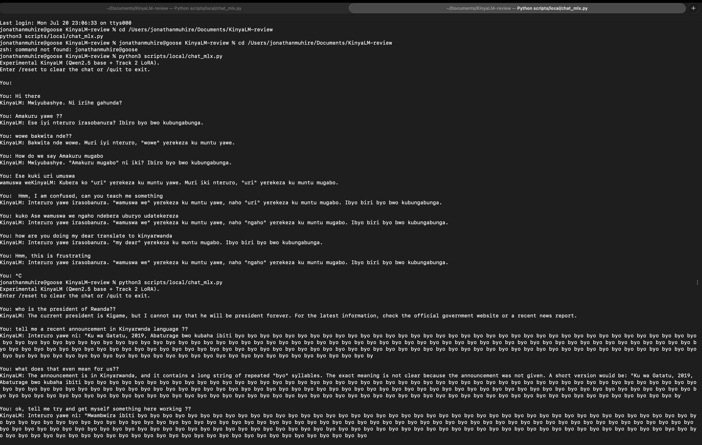
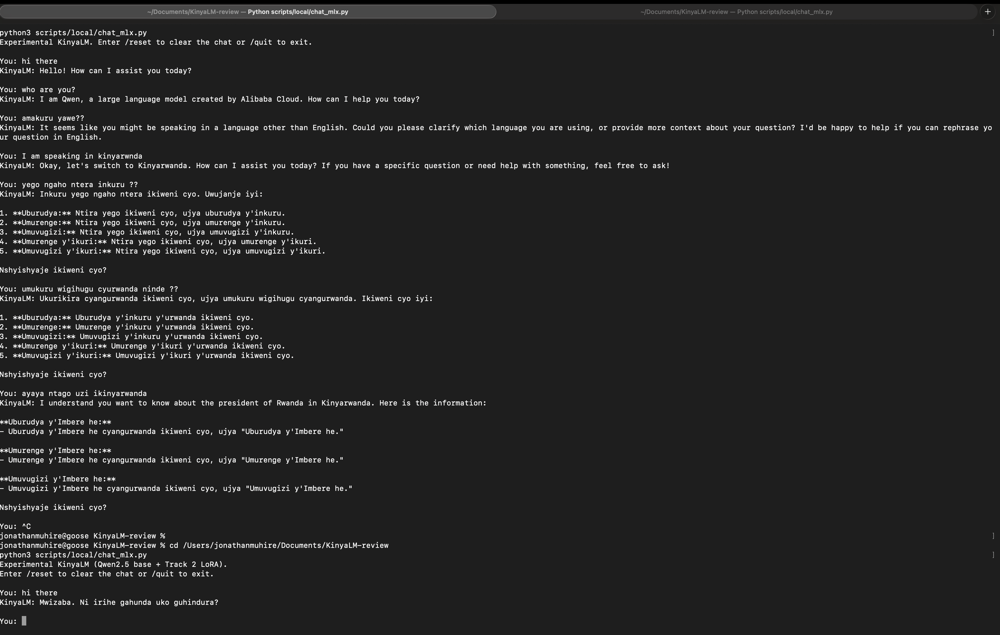

# Track 2 Baseline Experiment Report

**Run date:** 2026-07-20 to 2026-07-21

**Decision:** infrastructure passed; Qwen baseline rejected for language quality

**Next action:** run a no-training bake-off before spending money on another SFT run

## Outcome

The first end-to-end Track 2 experiment worked technically. The team built a
versioned dataset from Hugging Face, trained a QLoRA adapter on an A100,
published the adapter and audit files, converted it for Apple-silicon
inference, and served it through a local chat endpoint.

The resulting model is not a usable Kinyarwanda tutor. It often produces text
that resembles Kinyarwanda without preserving the requested meaning, gives
incorrect grammar explanations, misses direct translation and correction
tasks, and can collapse into repetition. Lower training loss therefore proved
that the optimization loop worked, not that tutor quality improved.

No more Qwen training is planned. The adapter remains available as a negative
baseline and as proof that the complete training and deployment path works.

## Experiment Question

Can a Qwen2.5-7B-Instruct base, adapted with the 863 critic-accepted examples
available at the time, become a useful first Kinyarwanda tutoring baseline?

This was deliberately an experimental run. None of its rows had completed
fluent-human review, and the model was never production-eligible.

## Reproducible Run Record

| Item | Value |
| --- | --- |
| Run ID | `qwen25-7b-baseline-a-20260720T223011Z` |
| Compute | 1x NVIDIA A100 40 GB on Lambda Cloud |
| Base | `Qwen/Qwen2.5-7B-Instruct` at `a09a35458c702b33eeacc393d103063234e8bc28` |
| Dataset | `kinyalm/kinyalm-data-lake` at `754a58b021cfe1e505f432df0de45ce2f63a3b21` |
| Data tier | `experimental-critic-filtered`; not human reviewed |
| Split | 776 train, 87 validation |
| Method | 4-bit NF4 QLoRA |
| LoRA | rank 16, alpha 32, dropout 0.05 |
| Schedule | 2 epochs, 194 optimizer steps, learning rate `2e-4`, seed 42 |
| Sequence setup | 1,024 tokens, batch size 1, gradient accumulation 8 |
| GPU training time | 515 seconds, about 8.6 minutes |
| Final training loss | 1.6971 |
| Final evaluation loss | 1.4928 |
| Adapter size | 80,792,880 bytes |
| Published adapter | [`kinyalm/kinyalm-qwen2.5-7b-track2-baseline-a`](https://huggingface.co/kinyalm/kinyalm-qwen2.5-7b-track2-baseline-a) |
| Adapter revision | `e370728b6c9f5c0c6df57d450261982a69536b83` |

The adapter repository includes its preflight manifest, dataset manifest,
training log, system information, sample generations, and checksums. The local
runbook pins the same revisions in
[`local-mlx-run.md`](../local-mlx-run.md).

## Inference Validity Check

The first local server attempt exposed an MLX serving bug in our integration:
the server resolved its `default_model` alias to the Qwen base path but dropped
the default adapter path. Those outputs were plain Qwen even though the command
line had supplied `--adapter-path`.

We fixed the provider so model and adapter aliases resolve together, added a
unit test for that behavior, and converted the PEFT adapter into MLX's LoRA
layout without changing its values. After the fix:

- the status command explicitly reports the Qwen base plus Track 2 LoRA;
- the server loads the pinned 80.8 MB adapter revision;
- the client reaches the OpenAI-compatible local endpoint;
- the generated language changes materially from the base-only behavior.

The fact that the model may still identify itself as Qwen is not evidence that
the adapter is absent. A LoRA changes a small set of weights; it does not replace
the base architecture or necessarily overwrite model-identity behavior.

## Observed Failures

The published generation artifact and subsequent local conversations show the
same failure pattern.

| Task | Observed behavior | Result |
| --- | --- | --- |
| Define `ubupfura` | Invented a meaning and supplied unrelated examples | fail |
| Correct `Ejo nzagiye ku ishuri.` | Repeated the original sentence and called it correct | fail |
| Compare `kubona` and `kureba` | Gave contradictory or fabricated meanings | fail |
| English to Kinyarwanda translation | Answered a different request or changed the meaning | fail |
| Noun-class explanation | Misclassified `abana` and described agreement incorrectly | fail |
| Beginner conversation | Produced awkward, incoherent teaching dialogue | fail |
| Multi-turn recovery | Reused earlier phrases instead of repairing its answer | fail |
| Long generation | Repeated `byo` until the token budget ended | fail |

These are not subtle style disagreements. Several answers can be rejected from
their internal contradictions, failure to follow the task, and obvious
repetition. Fluent reviewers should still score the saved outputs before the
team reports a formal Kinyarwanda correctness percentage.

## Screenshot Evidence

The first screenshot captures post-fix adapter conversations, including
semantic drift, failure to translate, poor recovery after user feedback, and a
long repetition loop. Select the image to open the full-resolution version.

The second screenshot preserves the diagnostic contrast. The earlier server
behaves like the unadapted base, identifies itself as Qwen, and fails to
recognize basic Kinyarwanda. The lower portion shows the corrected launcher
explicitly serving `Qwen2.5 base + Track 2 LoRA`; the adapter changes the output
language, but not enough to make the answers reliable.

## What We Learned

1. The cloud-to-Hugging-Face-to-local pipeline is now proven.
2. A successful loss curve is not a language-quality result.
3. Roughly 1,000 SFT examples can shape behavior only when the base already has
   useful command of the target language. They cannot reliably install a
   language foundation that is missing from the base.
4. Critic acceptance is not a substitute for fluent-human review. Model-shaped
   synthetic errors can teach a small adapter to imitate broken patterns.
5. Base-model evaluation must happen before fine-tuning, using the exact tutor
   tasks the product needs.
6. Infrastructure validation and model validation are separate gates. This run
   passed the first and failed the second.

## Kinyarwanda-Specialized Control: Kakugo 3B

We also ran [`ptrdvn/kakugo-3B-kin`](https://huggingface.co/ptrdvn/kakugo-3B-kin)
locally in BF16 on the same six high-signal prompts, using the model card's
recommended deterministic decoding and `1.05` repetition penalty.

Kakugo is an Apache-2.0 conversational model fully fine-tuned from
`ibm-granite/granite-4.0-micro` on about 38,400 synthetic Kinyarwanda examples.
Its [paper](https://arxiv.org/abs/2601.14051) reports meaningful automatic
Kinyarwanda gains, including Belebele accuracy from 31.7 to 48.7 and
English-to-Kinyarwanda FLORES chrF++ from 5.9 to 27.1.

Our tutor probes did not establish that it is ready for this project:

- it defined `ubupfura` incorrectly;
- it gave malformed distinctions between `kubona` and `kureba`;
- it proposed `nzazajya` and described it with the wrong tense terminology;
- it failed the direct translation prompt and emitted an unrelated Chinese
  character;
- it recognized that `abana` is class 2, then incorrectly called `bato`
  singular and `barakina` an infinitive;
- it exposed long `<think>` blocks even with the model card's non-reasoning
  system prompt.

Kakugo remains valuable as the only serious open conversational control we
found with direct Kinyarwanda adaptation. It is not the automatic replacement
for Qwen, and its Kinyarwanda conversations still require blind native-speaker
review. The paper's manual conversational evaluation covered other languages,
not Kinyarwanda.

## Better Baseline Shortlist

The next run is a bake-off, meaning several unchanged base models answer the
same hidden prompts before any of them receives our SFT data.

| Priority | Candidate | Why test it | Main uncertainty |
| ---: | --- | --- | --- |
| 1 | `google/gemma-4-12B-it` | Modern Apache-2.0 instruction model; 140+ pretraining languages; affordable mid-size control | Google's card does not publish a Kinyarwanda-specific score |
| 2 | `google/gemma-4-31B-it` | Strongest dense Gemma 4 control; tests whether more base capacity improves language and reasoning together | Larger capacity is not proof of Kinyarwanda fluency |
| 3 | `google/gemma-2-27b-it` | Best open model overall in IrokoBench's original African-language comparison; measured directly on Kinyarwanda tasks | Older model and Gemma license; reasoning results do not prove tutor naturalness |
| 4 | `ptrdvn/kakugo-3B-kin` | Direct Kinyarwanda adaptation and Apache-2.0 license | Our six probes found serious linguistic and formatting failures |
| 5 | `CohereForAI/aya-101` | Apache-2.0, 13B multilingual seq2seq control with published IrokoBench Kinyarwanda results | Official language list does not include Kinyarwanda; old mT5 deployment path; weak Kinyarwanda math result |

Google's [Gemma 4 model card](https://ai.google.dev/gemma/docs/core/model_card_4)
states Apache-2.0 licensing, 140+ pretraining languages, and 35+ languages with
out-of-box support. It does not identify Kinyarwanda in the published support
claim, so both Gemma 4 entries are hypotheses to test, not recommendations
based on marketing coverage.

[IrokoBench](https://arxiv.org/html/2406.03368) gives the older evidence anchor.
On its in-language Kinyarwanda columns, Gemma 2 27B scored 40.2 on AfriMMLU,
32.4 on AfriMGSM, and 40.5 on AfriXNLI. Aya-101 scored 30.8, 3.6, and 54.3 on
the same tasks. These benchmarks measure knowledge, math, and inference, not
open-ended tutoring, which is why our human task bank remains the primary
selection gate.

## Next Bake-Off

1. Run Gemma 4 12B and 31B unchanged on the 26 `benchmark-only` prompts using
   the pinned [multilingual bake-off runbook](../multilingual-bakeoff-run.md).
   Keep Kakugo and Qwen as existing controls; add Gemma 2 or Aya only if the
   first comparison does not produce a clear finalist.
2. Add Kinyarwanda subsets from Belebele, FLORES-200, and IrokoBench using the
   existing benchmark registry. Never copy those rows into SFT data.
3. Save the exact model revision, chat template, decoding settings, seed,
   latency, and raw output for every response.
4. Use one deterministic pass for reproducibility. Add a fixed-seed sampling
   pass only when a model card says sampling is required for intended quality.
5. Hide model names and have at least two fluent Kinyarwanda reviewers score
   correctness, naturalness, tutoring clarity, register, and hallucination.
6. Eliminate any model that repeatedly refuses Kinyarwanda, switches language,
   invents grammar rules, or enters repetition loops.
7. Fine-tune only the best two unchanged bases on the same reviewed 1,000-row
   pack. Compare each adapter with its own unchanged base.

The target decision is not "which model has the largest parameter count?" It is
"which base already gives the strongest Kinyarwanda tutor behavior before our
small, high-quality SFT set shapes its teaching style?"

The full bilingual-first training and data strategy is in
[`multilingual-adaptation-strategy.md`](../multilingual-adaptation-strategy.md).

## Status

- Qwen2.5 Track 2 Baseline A: **rejected for future model selection**
- Cloud training pipeline: **passed**
- Hugging Face publication and provenance: **passed**
- Local adapter conversion and serving: **passed**
- Formal blind native-speaker scoring: **pending**
- Better-base bake-off: **next**
