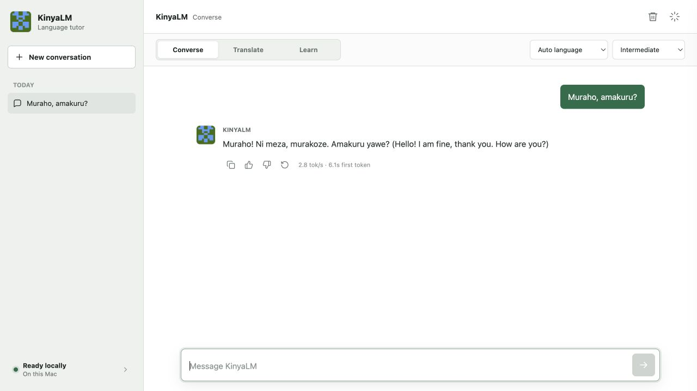
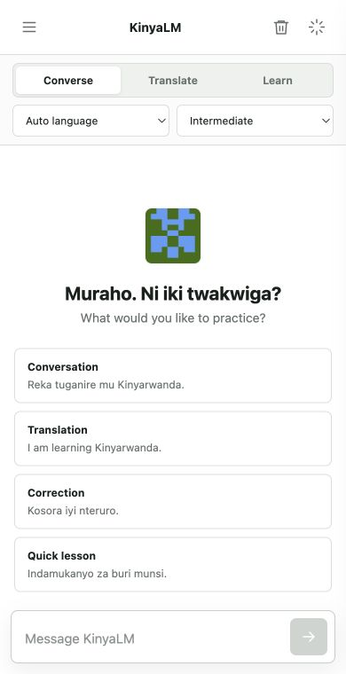
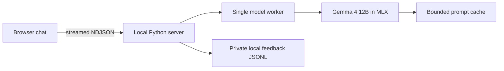

# Local KinyaLM Chat Demo

**Status:** working local prototype on Apple silicon

**Model:** `mlx-community/gemma-4-12B-it-qat-4bit`

**Purpose:** test Kinyarwanda tutoring behavior before spending cloud compute on
fine-tuning

## What Works Now

The browser demo keeps Gemma 4 12B resident in memory and streams each response
as it is generated. It provides three deliberately different behaviors:

| Mode | Intended behavior | Output limit |
| --- | --- | ---: |
| Converse | Focused conversation, usually 4-7 short sentences | 160 tokens |
| Translate | Translation or correction with up to three brief notes | 192 tokens |
| Learn | Fuller explanation, two examples, and a practice question | 256 tokens |

Language and learner-level controls change the model instruction without
reloading the checkpoint. Conversation context is limited to the latest six
turns so that long sessions do not become progressively slower.



The interface is responsive and remains usable at phone width:



## Run It

Requirements:

- an Apple-silicon Mac;
- enough free disk space for the roughly 10 GB checkpoint and runtime cache;
- enough unified memory to hold about 11.4 GB at peak; and
- internet access on the first run to fetch the checkpoint.

From the repository root:

```bash
bash scripts/local/chat_gemma4_web.sh --open
```

The launcher creates a private virtual environment under
`~/.cache/kinyalm/gemma4-12b-bakeoff`, pins MLX-LM `0.31.3`, and opens:

```text
http://127.0.0.1:8090
```

The model remains loaded until the server is stopped with `Ctrl-C`. A different
port can be selected with `--port`, for example:

```bash
bash scripts/local/chat_gemma4_web.sh --port 8091 --open
```

Frontend work can be tested without loading the 12B model:

```bash
python3 scripts/local/serve_gemma4_chat.py --mock --open
```

## Runtime Design



MLX creates GPU resources on the thread that loads the model. The server
therefore sends every generation request through one dedicated worker rather
than generating directly from HTTP request threads. This avoids intermittent
MLX stream errors and also ensures that the Mac handles only one expensive
generation at a time.

The local speed path combines:

- a QAT-derived mixed 4/8-bit checkpoint;
- one model load for the full server session;
- token streaming, so useful text appears before completion;
- mode-specific 160-256 token response limits rather than a 512-token default;
- six-turn bounded conversation history; and
- an LRU prompt cache capped at four entries and 512 MB.

The prompt cache reuses the longest matching conversation prefix. In a local
three-turn check, the second request reused 144 of 187 input tokens. This
reduces repeated prompt processing; it does not make generation itself faster.

## Measured Local Behavior

These are usability checks on the project's 32 GB Apple-silicon Mac, not a
formal quality benchmark:

| Check | Result |
| --- | --- |
| Simple Kinyarwanda greeting | 18 output tokens, 3.02 s to first token, 5.87 s total |
| Browser greeting after restart | 32 output tokens, 6.09 s to first token, 17.67 s total |
| Five-sentence smoke test after the length increase | 139 output tokens, 3.47 s to first token, 24.01 s total |
| Generation throughput observed | about 2.8-6.8 tokens/second |
| Peak unified memory observed | about 11.3 GB |
| Reused context on second cached turn | 144 of 187 input tokens |

The large latency range is normal for this local prototype: model warm-up,
prompt length, Mac temperature, and response length all matter. The important
change from the screening runner is interaction shape. The earlier 26-prompt
screen generated a median 408 tokens and took 104.57 seconds per answer; the
chat modes now stop at 160-256 tokens and stream the answer while it is produced.
This gives conversational answers room for roughly four to seven short
sentences while keeping the maximum well below the original screening budget.

The first two latency measurements above were collected before the July 22
response-length increase. Time to first token should remain similar, but a
response that uses the larger budget will take longer to finish.

The post-adjustment smoke test requested five Kinyarwanda sentences and returned
all five without reaching the 160-token limit. It streamed at 6.78 tokens/second
and peaked at 11.26 GB. The final sentence repeated a clause, so this run
confirms the longer streaming path but remains a quality-review failure.

## Feedback And Review

Thumbs-up and thumbs-down actions are written locally to:

```text
~/.cache/kinyalm/gemma4-12b-chat/feedback/feedback-YYYY-MM-DD.jsonl
```

A negative rating can include a corrected answer. The file is created with
owner-only permissions. It is not uploaded to Hugging Face automatically:
fluent reviewers must first remove private content, confirm the correction, and
approve its training license and status.

## Quality Boundary

This interface makes the model easier to test; it does not prove that Gemma 4
12B is ready for fine-tuning. The held-out screening report still records
meaning reversals and invented grammar explanations. The mode-specific prompt
reduces verbosity and asks the model to acknowledge uncertainty, but prompt
steering cannot repair knowledge the base model does not have.

Before a demo or training decision, the team should:

1. Run the 50-task bank through the interface or batch runner.
2. Have fluent speakers score correctness, naturalness, and teaching value.
3. Turn confirmed failures into reviewed corrections, not raw synthetic labels.
4. Fine-tune in the cloud only after the corrected set and held-out evaluation
   split are frozen.

## Verification

Run the focused checks:

```bash
python3 -m pytest -q \
  tests/test_demo_chat.py \
  tests/test_demo_server.py \
  tests/test_demo_frontend.py \
  tests/test_mlx_streaming.py
node --check apps/kinyalm-chat/app.js
```

The real-model smoke test is simply to launch the server, wait for the status
indicator to show `Ready`, and send one prompt in each mode. The mock mode is
appropriate for interface development but does not validate MLX or model
quality.
