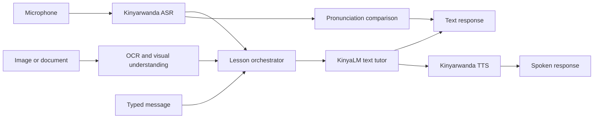

# KinyaLM Multimodal Expansion Roadmap

**Status:** recommendation for the next project phase

## Decision

Extend KinyaLM as a set of measurable components before trying to train one
large multimodal model. Keep the current text tutor as the reasoning and
teaching layer. Add speech recognition, speech synthesis, pronunciation
feedback, and image understanding around it through stable interfaces.

This approach is faster to test, cheaper to retrain, and makes failures easier
to locate. If the spoken answer is wrong, the team can determine whether the
error came from transcription, the tutor, or speech synthesis instead of
debugging one opaque end-to-end system.

## Target Experience

A learner should be able to:

- speak in Kinyarwanda or English and receive a relevant response;
- hear the answer spoken naturally in Kinyarwanda;
- practice pronunciation and receive word-level feedback;
- photograph a sign, worksheet, object, or short passage and ask about it;
- continue the same lesson across text, speech, and images;
- see uncertainty when any component lacks enough evidence.

## Recommended Architecture



Every handoff should store the raw input, component output, confidence or error
state, model revision, and reviewer correction. Audio and images must remain
private by default unless a contributor explicitly grants training and
redistribution rights.

## Phase 1: Speech Input

### Baselines

Evaluate at least two open automatic speech recognition systems on the same
native-recorded test set:

1. [Meta Omnilingual ASR](https://github.com/facebookresearch/omnilingual-asr)
   includes `kin_Latn` in its supported language list and offers CTC models from
   300M parameters upward under Apache 2.0. Start with the 300M or 1B CTC model
   for latency, then compare a larger model only if errors justify it.
2. [Meta MMS](https://ai.meta.com/research/publications/scaling-speech-technology-to-1000-languages/)
   provides multilingual wav2vec 2.0 speech recognition covering more than
   1,100 languages. Keep it as an independent baseline rather than assuming a
   newer model is automatically better on Kinyarwanda.

### Data

- [Mozilla Common Voice 25.0 Kinyarwanda](https://commonvoice.mozilla.org/en/datasets)
  is listed as a 57.18 GB CC0 scripted-speech dataset for locale `rw`.
- [FLEURS Kinyarwanda](https://huggingface.co/datasets/mbazaNLP/fleurs-kinyarwanda)
  is a smaller CC BY 4.0 benchmark candidate suitable for a held-out comparison.

Before download or training, record the exact release, speaker-consent terms,
license, checksum, and split policy in the data source log. Keep speakers, not
clips, disjoint across train, validation, and test when speaker identifiers are
available.

### Gate

- Report word error rate and character error rate overall.
- Break results down by speaker, noise, code-switching, utterance length, and
  conversational versus read speech.
- Native reviewers inspect at least 100 transcriptions, with special attention
  to morphology, names, numbers, and word boundaries.
- Do not connect ASR to the tutor by default until the interface clearly shows
  the transcript and lets the learner correct it.

## Phase 2: Spoken Responses

Use [Meta MMS Kinyarwanda TTS](https://huggingface.co/facebook/mms-tts-kin) as
the first research baseline. It is a small Kinyarwanda-specific VITS checkpoint
and works with Transformers, but its CC BY-NC 4.0 license blocks unapproved
commercial use. A product release therefore needs a compatible alternative or
a team-trained model from explicitly licensed recordings.

### Gate

- Native-speaker mean-opinion scores for naturalness and intelligibility.
- Exact listening tests for names, numbers, noun-class prefixes, punctuation,
  and questions.
- Compare audio against the source text to detect skipped, repeated, or changed
  words.
- Provide text output and a stop/mute control even when speech is enabled.

## Phase 3: Pronunciation Coach

Do not score pronunciation from the tutor model itself. Use the ASR transcript
and word or phoneme alignment to compare the learner recording with an approved
reference, then let KinyaLM explain the result in plain English or Kinyarwanda.

Start with limited, defensible feedback:

- which word was not recognized reliably;
- which approved reference pronunciation the learner can replay;
- whether a retry improved the same metric;
- uncertainty when noise or the recognizer prevents a fair score.

Avoid claims about accent quality or fluency until native reviewers establish
an annotation guide and agreement target. Pronunciation scoring can otherwise
penalize valid regional or speaker variation.

## Phase 4: Images And Documents

Use a separate vision-language model to convert visual evidence into structured
text before KinyaLM teaches from it. [PaliGemma 2 mix](https://developers.googleblog.com/introducing-paligemma-2-mix/)
supports captioning, OCR, visual question answering, detection, and segmentation
in open Gemma-family checkpoints. Initial tasks should be narrow:

- read a short Kinyarwanda sign or worksheet;
- identify a common object and teach its Kinyarwanda name;
- describe an image, then ask comprehension questions;
- compare the model answer with visible text instead of inventing context.

The vision component should return extracted text, grounded regions when
available, and an uncertainty state. KinyaLM should never present an OCR guess
as a certain correction.

### Gate

- Character accuracy for OCR.
- Exact-match or native-reviewed correctness for visual questions.
- Grounding checks: every claimed visible word or object must be present.
- Separate scores for photographed text, handwriting, objects, scenes, and
  culturally specific images.

## Phase 5: Shared Multimodal Lessons

Only after the individual components pass should the team build multi-turn
lessons that combine them. Store a typed event log instead of flattening every
modality into an untraceable prompt:

```json
{
  "turn_id": "turn-004",
  "input": {"type": "audio", "artifact_id": "audio-019"},
  "derived_text": "Ndashaka kwiga amazina y'ibiribwa.",
  "component": {"name": "asr", "revision": "pinned-revision"},
  "review": {"status": "corrected", "reviewer_id": "team-reviewer"}
}
```

This structure supports replay, error analysis, privacy deletion, and later
fine-tuning without losing where each label came from.

## Evaluation Matrix

| Layer | Primary metrics | Human check |
| --- | --- | --- |
| ASR | WER, CER, latency, failure rate | transcription correctness and natural word boundaries |
| Tutor | task pass rate, repetition, context retention | grammar, naturalness, instruction following |
| TTS | text coverage, synthesis latency | intelligibility and naturalness |
| Pronunciation | retry improvement, calibration | fairness across valid speaker variation |
| Vision/OCR | character accuracy, VQA accuracy, grounding | visible-evidence agreement |
| End to end | lesson completion, correction recovery, total latency | usefulness to a real learner |

Never report only an end-to-end score. A strong total can hide an unusable
speech recognizer or a tutor that repairs errors only after seeing leaked
reference text.

## Practical Sequence

| Milestone | Deliverable | Exit condition |
| --- | --- | --- |
| M1 | 100-recording Kinyarwanda ASR benchmark | two baselines scored and 100 rows reviewed |
| M2 | push-to-talk chat prototype | editable transcript, streaming tutor response, no silent failures |
| M3 | Kinyarwanda TTS prototype | 100 listening judgments and license boundary documented |
| M4 | 50-item pronunciation lesson set | reviewer agreement and uncertainty behavior established |
| M5 | 100-item image/OCR benchmark | grounded results by task type, not only aggregate accuracy |
| M6 | multimodal demo | one lesson crosses audio, text, and image with a complete event log |

## Recommendation

Build M1 and M2 next. Speech input adds the most direct learner value while
reusing the current tutor, interface, review process, and evaluation discipline.
TTS can follow quickly as a research demo. Image work should begin only after a
small grounded benchmark exists, and a unified multimodal fine-tune should wait
until the modular system reveals which component actually needs adaptation.
